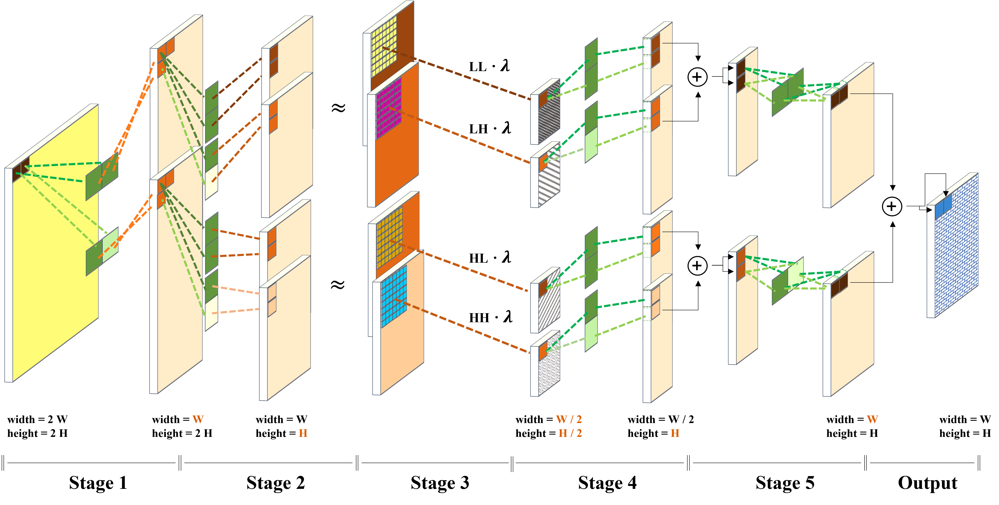

# DEL: Domain Embedding Layer (Official Project Webpage)
This repository provides the official PyTorch implementation of the following paper:

> **Abstract:** 
*Single-domain generalization (SDG) is known as the most challenging scenario for addressing the domain shift problem, in which a model is trained on a single source domain and evaluated for robustness on unseen domains. The key point for improving SDG performance lies in the ability of the model to distinguish between domain-invariant content information and domain-specific style information. Traditionally, extrinsic factors, such as augmentation policies and adversarial representations, have been leveraged in training to achieve this goal. Although these methodologies have demonstrated remarkable domain generalization performances, they tend to increase the number of model parameters and implementation complexity. This paper proposes an SDG solution based on a domain embedding layer (DEL), which replaces a portion of the existing network architecture without requiring additional training. The potential for improving domain generalization was demonstrated without relying on external factors by replacing the first layer of a deep neural network (DNN), which is known for learning semantic features, with a domain embedding layer (DEL) and training it end-to-end in the frequency domain, which can serve as an inherent factor. The frequency domain can be distinguished into low- and high- frequency components, associated with content and style information, respectively. DEL employs discrete wavelet transform (DWT) to enable learning from low- and high-frequency domains combined. DWT allows the frequency components to be utilized in the spatial domain without any additional transformations, enabling the utilization of the inductive bias from convolution operations without additional computational overhead. Moreover, DEL can be used in conjunction with other methodologies that leverage extrinsic factors, owing to its high compatibility. Experimental results show that by applying DEL enabled average improvements of 1.51\% and 1.85\% on the corrupted CIFAR-10-C  and Digits datasets, respectively, compared with  the generative model-based progressive domain expansion network.*

<p align="center">
  
</p>

## Pytorch Implementation
### Installation

```
conda create --name DEL python=3.9
conda env export > del.yaml
```

## Acknowledgments
Our pytorch implementation is heavily derived from [TIMM](https://github.com/huggingface/pytorch-image-models) and [Pytorch Wavelets](https://github.com/fbcotter/pytorch_wavelets).

Thanks to the NVIDIA implementations.
